## tmux

## Running commands in parallel

## Useful external tools

- ripgrep
- fd
- zet
- rush
- xan

## The Linux shell

## Piping and redirecting

Piping and redirecting are fundamental concepts in Linux that allow you to control how data flows between commands and files. They make the command line incredibly powerful by enabling you to chain commands together and manage input/output streams.

### Standard streams

- `stdin`: Data flows *into* a program.
- `stdout`: Data flows *out of* a program.
- `stderr`: Error messages flow *out of* a program separately.

```mermaid
graph LR
    INPUT["Data sources"]
    
    subgraph PROGRAM["Process"]
        STDIN["stdin"] --> PROC["🖥️"] 
        PROC --> STDOUT["stdout"]
        PROC --> STDERR["stderr"]
    end
    
    OUTPUT["Data destinations"]
    
    INPUT --> STDIN
    STDOUT --> OUTPUT
    STDERR --> OUTPUT
```




### Piping

The pipe operator `|` connects the stdout of one command to the stdin of another command.


```sh "|" title="Counting entries in a FASTA file"
awk '/^>/' genome.fasta | wc -l
```

```sh "|"
# ls writes to stdout → grep reads from stdin
ls -la | grep ".txt"

# cat writes file content to stdout → wc reads from stdin
cat file.txt | wc -l

# Multiple pipes create a pipeline
ps aux | grep firefox | awk '{print $2}'
#      ↑              ↑
#     stdout→stdin   stdout→stdin
```

#### The `songe` command

When you redirect output back to the same file you're reading from, the operation fails in an unexpected way. Consider this example where you want to sort sequences in a FASTA file by length using [SeqKit](https://bioinf.shenwei.me/seqkit) and save the result back to the same file:

```sh
seqkit sort -l sequences.fasta > sequences.fasta
```

This command empties `file.txt` completely. The `>` operator clears the file to prepare for writing before `sort` gets a chance to read it, resulting in total data loss.

The `sponge` command solves this problem by reading everything first, then writing to the file:

```sh
seqkit sort -l sequences.fasta | sponge sequences.fasta
```

Since `sponge` isn't included in standard Linux installations, you'll need to install it through the [`moreutils`](https://joeyh.name/code/moreutils/) package. Using [Pixi](../pixi/):

```sh
pixi global install moreutils
```

The `moreutils` package includes `sponge` along with several other handy command-line tools.

### Redirecting

| Operator | Description | Example |
|----------|-------------|---------|
| `>` | Redirect output to file (overwrite) | `echo "Hello" > file.txt` |
| `>>` | Redirect output to file (append) | `echo "World" >> file.txt` |
| `2>` | Redirect errors to file | `command 2> errors.log` |
| `&>` | Redirect both output and errors | `command &> all.log` |
| `2>&1` | Merge error stream (stderr → stdout) | `command > /dev/null 2>&1` |
| `<` | Read input from file | `sort < names.txt` |

### `/dev/stdin` and `/dev/stdout`

`/dev/stdin` and `/dev/stdout` are special file paths that map directly to a process’s standard input and output streams. They allow you to treat these streams like regular files. These pseudo-files are particularly useful when working with programs that don't support piping directly. Instead of creating temporary files, you can:
- Pass `/dev/stdin` to tools that require an input file path but need to read from a pipe
- Use `/dev/stdout` when a program insists on writing to a file but you want the output displayed in the terminal or piped to another command

One use case is [MUSCLE](https://github.com/rcedgar/muscle/), a tool for multiple sequence alignment that only accepts input and output as files. To make MUSCLE read from `stdin` and display the output in the terminal (`stdout`), you can run it like this:

```sh "/dev/stdin" "/dev/stdout"
echo -e ">seq1\nMYYGR\n>seq2\nMRYR" | muscle -align /dev/stdin -output /dev/stdout
```

### Common combinations

```sh "|" ">" "2>" "2>&1"
cat file.txt | sort | uniq > sorted.txt
command 2>&1 | tee output.log
find . -name "*.log" 2> /dev/null
```

### Process substitution

```sh /\<\x28[^\x29]*\x29/
zet intersect <(echo -e "A\nB\nC") <(echo -e "B\nC\nD")
```
