## tmux

## Piping and redirecting

Piping and redirecting are fundamental concepts in Linux that allow you to control how data flows between commands and files. They make the command line incredibly powerful by enabling you to chain commands together and manage input/output streams.

### Standard streams

Before diving in, understand the three standard streams:

- **stdin:** Data flows *into* a program.
- **stdout:** Data flows *out of* a program.
- **stderr:** Error messages flow *out of* a program separately.

### Piping

The pipe operator `|` connects the stdout of one command to the stdin of another command.

```sh "|" title="Counting entries in a FASTA file"
awk '/^>/' genome.fasta | wc -l
```

```sh "|"
# ls writes to stdout → grep reads from stdin
ls -la | grep ".txt"

# cat writes file content to stdout → wc reads from stdin
cat file.txt | wc -l

# Multiple pipes create a pipeline
ps aux | grep firefox | awk '{print $2}'
#      ↑              ↑
#     stdout→stdin   stdout→stdin
```

### Redirecting

| Operator | Description | Example |
|----------|-------------|---------|
| `>` | Redirect output to file (overwrite) | `echo "Hello" > file.txt` |
| `>>` | Redirect output to file (append) | `echo "World" >> file.txt` |
| `2>` | Redirect errors to file | `command 2> errors.log` |
| `&>` | Redirect both output and errors | `command &> all.log` |
| `2>&1` | Merge error stream (stderr → stdout) | `command > /dev/null 2>&1` |
| `<` | Read input from file | `sort < names.txt` |

### Process substitution

```sh /<([^()]+)/
# Treat command output as a file for stdin
diff <(ls dir1) <(ls dir2)
#     ↑          ↑
# stdout→temp   stdout→temp
# Both temps become stdin for diff
```



```mermaid
graph TD
    subgraph "Process/Command"
        PROC[["🖥️ Process<br/>(e.g., ls, grep, cat)"]]
    end
    
    subgraph "Input Sources"
        KB[["⌨️ Keyboard<br/>(default)"]]
        FILE_IN[["📄 Input File<br/>(via <)"]]
        PIPE_IN[["📊 Previous Command<br/>(via |)"]]
    end
    
    subgraph "Output Destinations"
        SCREEN[["🖵 Terminal Screen<br/>(default)"]]
        FILE_OUT[["📄 Output File<br/>(via >)"]]
        PIPE_OUT[["📊 Next Command<br/>(via |)"]]
        NULL[["🕳️ /dev/null<br/>(discard)"]]
    end
    
    %% stdin connections
    KB -.->|"default"| STDIN
    FILE_IN -->|"< redirect"| STDIN
    PIPE_IN -->|"| pipe"| STDIN
    STDIN -->|"fd 0"| PROC
    
    %% stdout connections
    PROC -->|"fd 1"| STDOUT
    STDOUT -.->|"default"| SCREEN
    STDOUT -->|"> redirect"| FILE_OUT
    STDOUT -->|"| pipe"| PIPE_OUT
    STDOUT -->|"> /dev/null"| NULL
    
    %% stderr connections
    PROC -->|"fd 2"| STDERR
    STDERR -.->|"default"| SCREEN
    STDERR -->|"2> redirect"| FILE_OUT
    STDERR -->|"2>&1"| STDOUT
    STDERR -->|"2> /dev/null"| NULL
    
    %% Stream definitions
    STDIN["📥 stdin<br/>(stream 0)"]
    STDOUT["📤 stdout<br/>(stream 1)"]
    STDERR["⚠️ stderr<br/>(stream 2)"]
    
    %% Styling
    style PROC fill:#e1f5fe
    style STDIN fill:#c8e6c9
    style STDOUT fill:#fff9c4
    style STDERR fill:#ffccbc
    style KB fill:#f5f5f5
    style SCREEN fill:#f5f5f5
    style NULL fill:#424242,color:#fff
```

### Common combinations

```sh "|" ">" "2>" "2>&1"
cat file.txt | sort | uniq > sorted.txt
command 2>&1 | tee output.log
find . -name "*.log" 2> /dev/null
```
